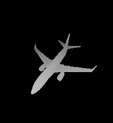
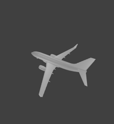

# shrec19-shape-retrieval
## Requirements
 

```
Blender 2.79
Python 3.x
```
## Folder structure

```
<output_data_folder>

|- ringview_i
	|- class_i
		|- obj_i			
			|- depth
				|- Image0001.png
				|- Image0002.png
				|- ...
			|- mask
				|- Image0001.png
				|- Image0002.png
				|- ...
			|- render
				|- Image0001.png
				|- Image0002.png
				|- ...
		|- ...
	|- ...
|- ...
```

## Usage
```
blender -b -P <path to script>
```
*Example*
```
blender -b -P '/home/ken/scripts blender/shrec19-shape-retrieval/tools/run.py'
```
## Extracted Data
[Link google drive](https://drive.google.com/drive/folders/1-JIGt7aIjtBkBxnA2kHeXaSDpMEhuno5?usp=sharing)

## Example 
<p align="center">
  
  
   <br />
  
  
   <br />
  
  
   <br />
</p>

